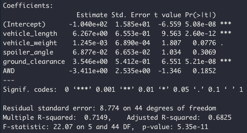
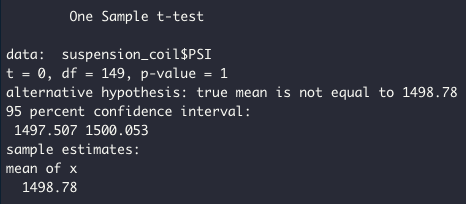
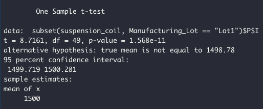
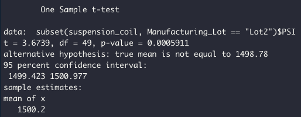
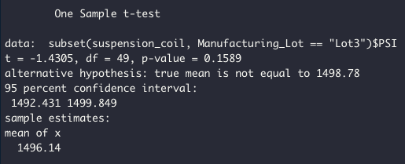

# MechaCar Statistical Analysis

## Linear Regression to Predict MPG

- We performed a multiple linear regression in order to determine which metrics predict MPG of MechaCar prototypes. We looked at vehicle length, vehicle weight, spoiler angle, drivetrain, and ground clearance. Our linear regression results show that vehicle length and ground clearance provided a non-random amount of variance to the MPG values in the dataset, while the other metrics did not have a statistically significant affect on MPG.
- The slope of the linear model would not be considered to be zero. Our p-value is 5.35e-11, which means there is a statistically significant relationship between the variables and MPG.
- We can say that this linear model predicts MPG of MechaCar prototypes effectively due to our p-value of 5.35e-11 being statistically significant (less than our level of significance of 0.05).

## Summary Statistics on Suspension Coils

The design specifications for the MechaCar suspension coils dictate that the variance of the suspension coils must not exceed 100 pounds per square inch.

Per our total summary table, we can see that overall, the variance is 62.29 pounds per square inch, which meets this requirement (it is less than 100 pounds per square inch).

Per our lot summary table, we can see that lots 1 and 2 meet this requirement. The variance is 0.98 and 7.47 pounds per square inch, respectively. Lot 3 does not meet this requirement, as their variance is 170.29 pounds per square inch (greater than 100 pounds per square inch).

## T-Tests on Suspension Coils

We performed multiple t-tests on whether or not PSI for suspension coils are statistically significant from the population mean. We performed one test across all three lots where they are manufactured, and one test per individual lot.

For our overall t-test, our p-value is 1. There is no statistically significant difference between the population mean (1498.78 pounds per square inch) and the sample mean (1498.78 pounds per square inch.

For our Lot1 t-test, our p-value is 1.56e-11. There is a statistically significant difference between the population mean (1498.78 pounds per square inch) and the sample mean (1500 pounds per square inch).

For our Lot2 t-test, our p-value is 0.0005911. There is a statistically significant difference between the population mean (1498.78 pounds per square inch) and the sample mean (1500.2 pounds per square inch).

For our Lot3 t-test, our p-value is 0.1589. There is not a statistically significant difference between the population mean (1498.78 pounds per square inch) and the sample mean (1496.14 pounds per square inch).

## Study Design: MechaCar vs Competition

A hypothetical statistical study that could quantify how the MechaCar performs against the competition could be a measure of how a car's horse power affects fuel efficiency. In this study, we would have a null hypothesis of no statistically significant difference between the MechaCar and a competitor's vehicle, and the alternative hypothesis would be that there is a statistically significant difference between the fuel efficiency and horse power of the MechaCar versus the competitor. We would use the two-sample t-test in this example, since we are comparing the same independent and dependent variables across two samples. The data we would need for this statistical test would be the horse power of each vehicle per car maker (independent variable) and the mean fuel efficiency of the vehicle per car maker (dependent variable).
